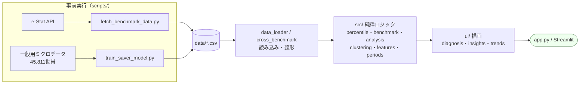

# 家計調査ダッシュボード — 家計の立ち位置診断と貯蓄余力の分析

> 📦 **リポジトリ（アプリ本体・分析コード・テストの全ソース）**
> **https://github.com/kyiku/household-finance-analysis**
> このREADME内のリンクはすべてGitHub上の該当ファイルへ直接飛べます。

総務省の公的統計（家計調査・全国家計構造調査・一般用ミクロデータ）を使って、
「あなたの家計は世の中と比べてどうか」を診断する Streamlit アプリと、
「貯蓄余力の高い世帯は何が違うか」の機械学習分析です。

チーム開発課題（AIProgrammingⅣ）の成果物。

### 提出資料の対応表

| 必須項目 | 本READMEの該当箇所 | 補足資料 | 該当ソース |
|---|---|---|---|
| プロジェクトの背景・目的 | [1章](#1-背景と目的) | [設計判断の記録](https://github.com/kyiku/household-finance-analysis/blob/main/DESIGN_DECISIONS.md) | — |
| データセット（参照元・列の説明） | [4章](#4-使用データセット) | [用語辞典](https://github.com/kyiku/household-finance-analysis/blob/main/GLOSSARY.md) §1・§8・§9 | [`data_loader.py`](https://github.com/kyiku/household-finance-analysis/blob/main/src/data_loader.py) / [`microdata.py`](https://github.com/kyiku/household-finance-analysis/blob/main/src/microdata.py) |
| 分析手法（モデル・アルゴリズム） | [5章](#5-分析手法) | [用語辞典](https://github.com/kyiku/household-finance-analysis/blob/main/GLOSSARY.md) §6・§7 | [`percentile.py`](https://github.com/kyiku/household-finance-analysis/blob/main/src/percentile.py) / [`clustering.py`](https://github.com/kyiku/household-finance-analysis/blob/main/src/clustering.py) / [`train_saver_model.py`](https://github.com/kyiku/household-finance-analysis/blob/main/scripts/train_saver_model.py) |
| アプリ構成 | [6章](#6-アプリ構成) | — | [`app.py`](https://github.com/kyiku/household-finance-analysis/blob/main/app.py) / [`src/`](https://github.com/kyiku/household-finance-analysis/tree/main/src) / [`ui/`](https://github.com/kyiku/household-finance-analysis/tree/main/ui) |

### メンバーと担当

課題テーマに使う公的統計の調査・選定は、メンバー4名でそれぞれ候補を探して持ち寄る形で進めました。
選定後のデータ取得から分析設計・アプリ実装・テスト・ドキュメントまでは比嘉が担当しています。

| メンバー | 担当 |
|---|---|
| 宮崎 | データセットの調査・選定 |
| 石田 | データセットの調査・選定 |
| 田中 | データセットの調査・選定 |
| 比嘉 | データセットの調査・選定／データ取得（e-Stat API・一般用ミクロデータ）／分析設計（[5章](#5-分析手法)）／アプリ実装（[6章](#6-アプリ構成)）／テスト（[7章](#7-テスト)）／ドキュメント（本README・用語辞典・設計判断の記録） |


**目次**

1. [背景と目的](#1-背景と目的)
2. [何ができるか](#2-何ができるか)
3. [セットアップと起動](#3-セットアップと起動)
4. [使用データセット](#4-使用データセット)
5. [分析手法](#5-分析手法)
6. [アプリ構成](#6-アプリ構成)
7. [テスト](#7-テスト)
8. [データの再取得（任意）](#8-データの再取得任意)
9. [出典・利用上の注意](#9-出典利用上の注意)

関連ドキュメント: [`GLOSSARY.md`](https://github.com/kyiku/household-finance-analysis/blob/main/GLOSSARY.md)（統計用語・家計指標・分析手法・データ列の辞書） /
[`DESIGN_DECISIONS.md`](https://github.com/kyiku/household-finance-analysis/blob/main/DESIGN_DECISIONS.md)（設計判断の記録 D1〜D13）

---

## 1. 背景と目的

### 課題意識

自分の家計が他と比べてどうなのかを知る手段は、実質「平均値との比較」しかありません。
しかしそれには2つの落とし穴があります。

- **平均は分布の代表値になっていない。** 貯蓄額の分布は右に大きく歪んでおり、
  2025年の二人以上世帯は平均約1,900万円に対し中央値は約1,183万円。
  「平均以下」でも実際には上位半分の中にいることがあり、平均との差は立ち位置を誤らせます。
- **年齢を無視した比較は誤読を生む。** 収入階級別に貯蓄を見ると「低収入階級ほど貯蓄が多い」
  という奇妙な関係が現れますが、これは低収入階級に退職後の高齢世帯が多いという
  **交絡**によるものです（年収600〜650万円の平均貯蓄は全年代混在で約1,940万円、
  40代に限ると約654万円）。

### 目的

上記を踏まえ、本プロジェクトは次の2つに答えます。

| | 問い | 答え方 | 使うデータ |
|---|---|---|---|
| **(a)** | 私の家計は世の中のどのあたりか | 分布上のパーセンタイルと、年齢で層別した比較 | 家計調査・全国家計構造調査の**集計データ** |
| **(b)** | 貯蓄余力の高い世帯は何が違うか | 支出の使い方から貯蓄余力の高低を分類する機械学習 | 一般用ミクロデータの**擬似個票** |

(a) と (b) でデータを分けているのは意図的です。集計データからは「グループの傾向」しか言えず、
「個々の世帯の特徴」を語るには個票が必要（**生態学的誤謬**を避ける）——この区別が
本プロジェクトの分析設計を貫く原則です。詳細な経緯は
[`DESIGN_DECISIONS.md`](https://github.com/kyiku/household-finance-analysis/blob/main/DESIGN_DECISIONS.md) D4・D10・D11 を参照。

### スコープ外

- 家計簿としての入出金記録・個人データの保存（入力値はセッション内でのみ使用し、保存しません）
- 将来の貯蓄額の予測（時系列予測はしません）
- DB・APIサーバー化（Streamlit 単体で完結させています）

---

## 2. 何ができるか

- 🩺 **あなたの家計診断** — 貯蓄のパーセンタイル（分布の下から◯%地点）、同年代×同収入・
  同収入階級・同年代との比較、黒字率診断、家計タイプマップ（参考）
- 💡 **統計にみる貯蓄の傾向** — 擬似個票4.6万世帯の機械学習分析（ランダムフォレスト ROC-AUC 0.774）と、
  黒字率・資産構成の集計分析
- 📈 **データとトレンド** — 24年分の時系列、年代で絞った収入×貯蓄の関係

---

## 3. セットアップと起動

### 動作確認済みの環境

| 項目 | 検証した値 |
|---|---|
| Python | **3.12.14** と **3.14.7** の2バージョンでクリーンインストールから検証（macOS / Apple Silicon） |
| 依存パッケージ | `requirements.txt` に**実測値でバージョン固定**（`pandas==3.0.3` など） |
| 検証内容 | クリーンインストール → `pytest tests`（92 passed, 1 skipped）→ `streamlit run app.py` が HTTP 200 で応答 |

Python 3.13 は未検証ですが、依存パッケージはいずれも3.12〜3.14をサポートしています。

### 手順（macOS / Linux）

```bash
git clone https://github.com/kyiku/household-finance-analysis.git
cd household-finance-analysis

python3 -m venv .venv              # macOS/Linux には python が無い環境が多いので python3
source .venv/bin/activate
python -m pip install -U pip       # 有効化後は python / pip が仮想環境のものになる
pip install -r requirements.txt
```

### 手順（Windows / PowerShell）

```powershell
git clone https://github.com/kyiku/household-finance-analysis.git
cd household-finance-analysis

py -3 -m venv .venv
.venv\Scripts\Activate.ps1        # 実行が拒否される場合: Set-ExecutionPolicy -Scope Process RemoteSigned
python -m pip install -U pip
pip install -r requirements.txt
```

### 起動

分析済みデータ（`data/*.csv`）と学習済みモデル結果は同梱しているので、そのまま起動できます。
**リポジトリ直下で実行してください**（`app.py` が `data/` を相対パスで読むため）。

```bash
streamlit run app.py
```

起動すると**ターミナルにURLが表示されるので、それを開いてください**。
既定は http://localhost:8501 ですが、8501が他のプロセスに使われている場合
Streamlit は自動で別のポート（8502…）を選ぶため、URLは環境によって変わります。
固定したい場合はポートを明示します。

```bash
streamlit run app.py --server.port 8501
```

### 動作確認

```bash
pytest tests -q            # 92 passed, 1 skipped と表示されれば環境構築は成功
```

skipされる1件は、ミクロデータの実ファイルを読むテストです。学習データは未加工の
zipとしてのみ同梱しているため（[4章](#4-使用データセット)）、展開前は自動でskipされます。
[8章](#8-データの再取得任意)の `unzip` を実行すると **93 passed** になります。

### うまくいかないとき

| 症状 | 原因 | 対処 |
|---|---|---|
| `python: command not found` | macOS/Linux には `python` が無く `python3` のみ | 仮想環境を作るまでは `python3` を使う（有効化後は `python` で可） |
| `ModuleNotFoundError: No module named 'src'` | リポジトリ直下以外で実行した／`conftest.py` を削除した | 直下で実行する。`conftest.py` は空でも**削除しない**（[7章](#7-テスト)） |
| `FileNotFoundError: data/....csv` | カレントディレクトリが違う | `cd household-finance-analysis` してから `streamlit run app.py` |
| ブラウザで 8501 が開かない | ポートが使用中で別ポートに割り当てられた | ターミナルに表示されたURLを開く／`--server.port` で指定 |
| グラフの日本語が □ になる | japanize-matplotlib が入っていない | `pip install -r requirements.txt` をやり直す |
| 依存の解決に失敗する／別バージョンが入る | ローカルに既存パッケージが混在している | 完全再現用のロックファイルを使う: `pip install -r requirements-lock.txt`（開発環境の全136パッケージを固定） |
| ノートブックを開けない | Jupyter は `requirements.txt` に含めていない | `pip install -r requirements-notebooks.txt`（Colab版を使う場合は不要） |

---

## 4. 使用データセット

3つの公的統計を、目的別に使い分けています。

| 出典 | 実施主体・頻度 | 本プロジェクトでの役割 |
|---|---|---|
| **家計調査** | 総務省統計局・毎月（約9,000世帯の標本調査） | 診断のベンチマークと長期トレンド |
| **2019年全国家計構造調査** | 総務省統計局・5年ごと（約9万世帯） | 「年齢×収入」クロス比較（標本が大きく細かいクロス集計が可能） |
| **一般用ミクロデータ**（平成21年全国消費実態調査・十大費目） | 統計センター提供の**擬似個票** 45,811世帯 | 機械学習の学習データ |

### 集計データ（`data/`・リポジトリ同梱）

| ファイル | 出典・粒度 | 期間 | 列 | 項目 |
|---|---|---|---|---|
| `kakei_savings_debt_by_income.csv` | 家計調査／年間収入階級18区分・四半期 | 2002Q1〜2025Q4 | 項目, 年間収入階級, 時期, 値, 単位 | 年間収入・貯蓄・負債（万円） |
| `kakei_savings_debt_by_age.csv` | 家計調査／年齢階級6区分・四半期 | 2002Q1〜2025Q4 | 項目, 年齢階級, 時期, 値, 単位 | 年間収入・貯蓄・負債（万円） |
| `kakei_savings_breakdown_by_age.csv` | 家計調査／年齢階級6区分・四半期 | 2002Q1〜2025Q4 | 項目, 年齢階級, 時期, 値, 単位 | 通貨性預貯金・定期性預貯金・生命保険など・有価証券・金融機関外（万円） |
| `kakei_income_expense_by_age.csv` | 家計調査／年齢階級5歳刻み・月次 | 2000年1月〜2026年5月 | 項目, 年齢階級, 時期, 値, 単位 | 実収入・可処分所得・消費支出・黒字・黒字率・平均消費性向（円・%） |
| `kakei_surplus_rate_by_income_quintile.csv` | 家計調査／年収五分位・勤労者世帯・四半期 | 2000Q1〜2026Q1 | 項目, 世帯区分, 年間収入五分位, 時期, 値, 単位 | 同上（円・%） |
| `kakei_savings_distribution.csv` | 家計調査／貯蓄現在高19階級・年次 | 2002〜2025年 | 貯蓄現在高階級, 年, 世帯数分布 | 世帯数分布（**万分比**＝10,000分のいくつ） |
| `kouzou_savings_by_age_income.csv` | 2019年全国家計構造調査／年齢6階級×年間収入41区分 | 2019年（単年） | 項目, 年齢階級, 年間収入階級, 値, 単位 | 集計世帯数・世帯数分布・年間収入額・貯蓄現在高・負債現在高（万円） |

**時期コード**は e-Stat の期間識別子で `YYYY` + `00` + 開始月2桁 + 終了月2桁 の形式です
（例: `2025001012` = 2025年10〜12月期、`2000000101` = 2000年1月）。`src/periods.py` でパースします。

### 個票データ（`microdata/ippan_2009zensho.zip`・**リポジトリ同梱**）

学習データは統計センターからダウンロードした **未加工のフルセットzip のまま同梱**しています
（4.9MB）。展開すると `ippan_2009zensho_z_dataset.csv`（全世帯 45,811行、Shift_JIS、
冒頭5行は注記）が得られ、モデルの再学習まで完全に再現できます。

<details>
<summary><b>同梱に至った経緯（当初は非同梱だった）</b></summary>

開発当初は「規約上、第三者への再配布は不可」と判断して非同梱とし、READMEに各自ダウンロードの
手順だけを載せていました。その後 [一般用ミクロデータ利用規約](https://www.nstac.go.jp/use/archives/ippan-microdata/request/)
を条文まで確認したところ、**再配布は禁止されておらず、条件付きで認められている**ことが分かりました。

> **第3条 第三者への配布について**
> 第三者に一般用ミクロデータを配布する場合には、編集・加工されたデータではなく、
> 当サイトからダウンロードしたフルセットデータで配布してください。

第4条の禁止事項は「営利活動（販売など）」「国家・国民の安全への脅威」「法令・公序良俗違反」
「統計調査結果のデータから作成したかのような態様での公表」の4項目で、本プロジェクト
（非営利の授業課題、出典表記あり、擬似データである旨を明記）はいずれにも該当しません。

そこで方針を変更し、**ダウンロードしたzipをそのまま**同梱することにしました。zipのままなのは
第3条の「編集・加工されたデータではなく、フルセットデータで」という条件を文字どおり満たすためで、
`.gitignore` では展開後のディレクトリ（`microdata/ippan_2009zensho/`）を除外しています。
判断の詳細は [`DESIGN_DECISIONS.md`](https://github.com/kyiku/household-finance-analysis/blob/main/DESIGN_DECISIONS.md) D12。

</details>

使用列は次のとおりです:

| 列名 | 内容 | 本プロジェクトでの扱い |
|---|---|---|
| `Y_Income` | 年間収入（税込、千円） | 目的変数の計算のみ。**特徴量には入れない** |
| `L_Expenditure` | 月間消費支出合計（円） | 同上（構成比の分母としても使用） |
| `Weight` | 集計用乗率（母集団を代表する重み） | 学習・評価の `sample_weight` |
| `Food` `Housing` `LFW` `Furniture` `Clothes` `Health` `Transport` `Education` `Recreation` `OL_Expenditure` | 十大費目の支出額（食料／住居／光熱・水道／家具・家事用品／被服及び履物／保健医療／交通・通信／教育／教養娯楽／その他消費） | `L_Expenditure` で割って**支出構成比10列**に変換 |
| `3City` | 3大都市圏かどうか | 0/1 に変換 |
| `T_SeJinin` | 世帯人員区分 | 「3人以上世帯」0/1 |
| `T_SyuJinin` | 就業人員区分 | 「就業人員2人以上」0/1 |
| `T_JuSyoyu` | 住居の所有関係 | 「持家」0/1 |
| `T_Syuhi` | 世帯主の就業状態 | 「世帯主就業」0/1 |
| `T_Age_65` | 世帯主が65歳以上か | 「65歳以上」0/1 |

未使用列: `T_Age_5s`（世帯主年齢5歳階級。`T_Age_65` と情報が重複するため）。

各列の完全な定義（変換条件つき）は [`GLOSSARY.md`](https://github.com/kyiku/household-finance-analysis/blob/main/GLOSSARY.md) §9、
統計用語は §1・§6・§7 にまとめています。

---

## 5. 分析手法

### 5.1 パーセンタイル推定（線形補間）

階級別の世帯数分布から連続的な立ち位置を出す手法です（`src/percentile.py`）。
貯蓄額 x が階級 [L, U) に入るとき、階級内は**一様分布**とみなして按分します。

```
パーセンタイル(x) = ( Σ(x未満の階級の世帯数分布) + (x − L)/(U − L) × その階級の世帯数分布 ) / 総和 × 100
```

平均との差ではなくパーセンタイルを主指標にしたのは、貯蓄分布が右に歪んでおり
平均比較がユーザーの直感とズレるためです。最上位階級（4000万円以上）は上限が開いていて
補間できないため、その階級より下の累積割合を返します（＝控えめ側に倒す）。

### 5.2 ローリング平均によるベンチマーク

比較基準は全期間平均ではなく「**各グループで公表済みの直近1年分**」の平均を使います
（四半期データは4期、月次データは12か月。`src/benchmark.py: latest_mean_by`）。

- 全期間（約26年）平均だと2000年代前半の水準が混ざり、「今のあなた」の基準として不適切
- 「最新の暦年」でのフィルタも不適切: 2026年はQ1しかなく季節バイアス（ボーナス期を含まない）で
  黒字率が最大10pt歪み、若年層の未公表セルが NaN になって診断が機能停止する

### 5.3 層別による交絡の除去

年齢を交絡変数として**層別**し、「同年代×同収入」で比較します（`src/cross_benchmark.py`）。
2019年全国家計構造調査の年齢10歳階級はアプリの年代6区分と完全に対応します。
標本の希少セル（若年×高収入など）は未公表のため `None` を返し、UI は代替比較へ誘導します。

### 5.4 KMeans クラスタリング（参考扱い）と、その限界

`src/clustering.py` で k=4 のクラスタリングを行い、特徴に基づく名前
（例: 高収入・高貯蓄型）を自動付与します。特徴量は年間収入・貯蓄・負債・貯蓄/年収倍率・
負債/年収倍率の5つで、`StandardScaler` で標準化してから距離を計算します。

ただし**サンプルは世帯の個票ではなく「収入階級×四半期の集計値」**（18階級×96期＝約1,700点）です。
集計値のクラスタリング結果を「あなたはクラスタ2」と提示するのは個票分類のような誤った印象を与える
（生態学的誤謬）ため、診断の主役から降ろし「家計タイプマップ（参考）」に位置づけました。
この**手法選定の判断そのもの**が本プロジェクトの分析上の要点です。

### 5.5 二値分類による個票分析（主モデル）

「貯蓄余力の高い世帯は何にお金を使っているか」を、擬似個票で分類問題として解きます
（`src/microdata.py` ＋ `scripts/train_saver_model.py`）。

**目的変数**: 貯蓄額の変数が無いため、黒字率の近似として

```
貯蓄余力率 = 1 − 年間消費支出 / 年間収入(税込)
```

を定義し、**中央値（0.427）以上を「貯蓄余力の高い世帯」= 1** とする二値ラベルにしました
（可処分所得ベースではない点に注意）。

**特徴量16個**: 十大費目の**支出構成比10** ＋ **世帯属性6**（0/1）。
収入・支出の金額そのものは目的変数の構成要素なので**除外しています**（データリーケージの防止）。
結果として「金額の大小」ではなく「**何にお金を使う世帯が貯蓄できているか**」という
行動の問いに答える設計になります。

**学習設定**: 45,811世帯を学習70%（32,067）/ 検証30%（13,744）に層化分割。
集計用乗率 `Weight` を学習・評価の `sample_weight` に使用。`random_state=42` で再現可能。

**比較したモデル**（理論の詳細は [`GLOSSARY.md`](https://github.com/kyiku/household-finance-analysis/blob/main/GLOSSARY.md) §7）:

| モデル | 仕組み | 設定 | 精度 | ROC-AUC |
|---|---|---|---|---|
| ロジスティック回帰 | 特徴量の重み付き和をシグモイド関数で確率に変換する線形分類器。係数の符号で効き方を解釈できる | `StandardScaler` + `max_iter=1000` | 0.699 | 0.765 |
| 決定木 | 「住居費比率が◯%以上か」の分岐の繰り返し。if-then 規則として読める | `max_depth=4`（過学習抑制） | 0.676 | 0.742 |
| **ランダムフォレスト** | 決定木200本を訓練データ・特徴量をランダムに変えて育て、多数決するアンサンブル | `n_estimators=200`, `min_samples_leaf=20` | **0.702** | **0.774** |

ROC-AUC は「ランダムに選んだ正例に、負例より高いスコアを付けられる確率」で、
0.5＝当てずっぽう、1.0＝完璧。閾値に依存しないためモデル比較の標準指標です。

**特徴量重要度（ランダムフォレスト・上位5）**:
食料比率 0.205 / 光熱・水道比率 0.190 / 世帯主就業 0.093 / 住居比率 0.067 / 交通・通信比率 0.064

**2群の支出構成比（加重平均, %）**:

| | 食料 | 住居 | 光熱・水道 | 交通・通信 |
|---|---|---|---|---|
| 貯蓄余力の**低い**世帯 | 22.95 | 7.68 | 6.43 | 14.75 |
| 貯蓄余力の**高い**世帯 | 28.17 | 4.57 | 8.42 | 11.26 |

**解釈**: 貯蓄余力の高い世帯は**住居費比率（7.7%→4.6%）と交通・通信費比率が低い**。
一方で食料・光熱の構成比が高いのは、消費総額を絞ると必需品の割合が相対的に上がるためで、
「食費をかけると貯蓄できる」という意味ではありません。
重要度は**因果ではなく予測への寄与**である点にも注意が必要です。

---

## 6. アプリ構成

### データフロー

学習とAPI取得は**事前実行**し、アプリ本体は結果CSVを読むだけにしています（起動を軽く保つため）。



- **`app.py`** — エントリポイント。データ読み込み・キャッシュ・タブ振り分けのみ
- **`src/`** — Streamlit に依存しない純粋ロジック（引数と戻り値だけ。全関数ユニットテスト済み）
- **`ui/`** — タブごとの描画。計算は `src/` に委譲する
- **`scripts/`** — 事前実行スクリプト（アプリ起動時には走らない）

### 画面構成（3タブ）

| タブ | セクション | 使うデータ・ロジック |
|---|---|---|
| 🩺 **あなたの家計診断**<br/>`ui/diagnosis.py` | ① 貯蓄の立ち位置（分布） | `savings_distribution` + `percentile.py` |
| | ② 同年代×同収入との比較 | `kouzou_*` + `cross_benchmark.py` |
| | ③ 同じ収入階級との比較 | `savings_debt_by_income` + `benchmark.py` |
| | ④ 同年代との比較 | `savings_debt_by_age` + `benchmark.py` |
| | ⑤ 黒字率診断（任意入力） | `income_expense_by_age`, `surplus_by_quintile` |
| | ⑥ 家計タイプマップ（参考） | `clustering.py`（KMeans k=4） |
| 💡 **統計にみる貯蓄の傾向**<br/>`ui/insights.py` | 特徴1 黒字率は収入階級でほぼ決まる | `surplus_by_quintile` + `analysis.py` |
| | 特徴2 どの収入層も黒字率は長期的に上昇 | 同上（時系列） |
| | 特徴3 黒字率のピークは30代後半〜40代前半 | `income_expense_by_age` |
| | 特徴4 貯蓄の「中身」は年代で変わる | `savings_breakdown_by_age` |
| | 個票分析（機械学習） | `microdata_*.csv`（学習済み結果） |
| 📈 **データとトレンド**<br/>`ui/trends.py` | 年代別 貯蓄・負債の長期推移 | `savings_debt_by_age` + `periods.py` |
| | 収入階級別 貯蓄・負債（直近1年） | `savings_debt_by_income` |
| | 年代で絞った収入階級別（2019年） | `kouzou_*` |

診断タブの入力は年収・貯蓄・負債（必須）と手取り月収・月間消費支出（任意）。
任意にしているのは入力障壁を上げないためで、入力があればストック（貯蓄残高）に加えて
フロー（毎月貯蓄できているか）も診断します。

### キャッシュ設計

- `@st.cache_data` — CSV読み込み・整形結果（データフレームのコピーが各セッションに渡る）
- `@st.cache_resource` — KMeans モデル（全セッション共有。**読み取り専用で扱う**）

### ディレクトリ

```
household-finance-analysis/
  app.py                 # Streamlit エントリポイント(3タブ)
  src/                   # 純粋ロジック(すべてユニットテスト済み)
    periods.py           #   e-Stat時期コードのパース
    data_loader.py       #   CSV読み込み・整形
    benchmark.py         #   直近1年ローリング平均ベンチマーク
    percentile.py        #   貯蓄分布のパーセンタイル推定(線形補間)
    cross_benchmark.py   #   同年代×同収入ベンチマーク
    clustering.py        #   家計タイプマップ(KMeans・参考情報)
    analysis.py          #   黒字率・貯蓄内訳などの集計
    features.py          #   比率計算・収入階級判定・入力検証
    microdata.py         #   擬似個票の特徴量構築・結果CSV読み込み
  ui/                    # Streamlit 画面(タブごと)
    diagnosis.py         #   タブ1 あなたの家計診断
    insights.py          #   タブ2 統計にみる貯蓄の傾向
    trends.py            #   タブ3 データとトレンド
  scripts/               # データ取得・モデル学習(事前実行)
  tests/                 # pytest(93件) + AppTestスモーク
  data/                  # 取得済みCSV + モデル結果
  microdata/             # 一般用ミクロデータ(フルセットzip同梱)
  notebooks/             # データ取得・探索ノートブック(下表)
  conftest.py            # pytestのimportルート指定(空だが必須)
  requirements.txt              # アプリ実行+テスト(バージョン固定)
  requirements-notebooks.txt    # ノートブック実行時のみ追加
  requirements-lock.txt         # 完全再現用(全依存をpip freezeで固定)
  README.md
  GLOSSARY.md                   # 用語辞典
  DESIGN_DECISIONS.md           # 意思決定の記録(D1〜D13)
```

### ノートブック（`notebooks/`）

アプリ本体とは独立した、データ取得と探索の作業記録です。
`_colab` 付きは Google Colab で動かすための版（Secrets / Drive マウント対応）で、
中身の分析は対応するローカル版と同じです。

| ファイル | 内容 |
|---|---|
| `kakei_data_fetch.ipynb` | e-Stat API から家計調査の基本5データセットを取得する手順（README 8章から参照） |
| `kakei_data_fetch_colab.ipynb` | 同上のColab版（appIdはColab Secretsから読む） |
| `kakei_data_overview.ipynb` | 取得データの概要把握と傾向分析。**グラフ出力を保存済みなのでGitHub上でそのまま閲覧できます** |
| `kakei_data_overview_colab.ipynb` | 同上のColab版 |
| `kakei_analysis_colab.ipynb` | 初期分析（収入階級別の貯蓄推移・年収五分位別の黒字率）。アプリ化前の検討段階の記録 |

---

## 7. テスト

**リポジトリ直下で実行してください。**

```bash
pytest tests -q                    # 93テスト
pytest tests --cov=src             # カバレッジ
```

`conftest.py`（リポジトリ直下・中身は空）は、pytest がリポジトリ直下を import ルートとして
扱うためのマーカーです。**削除すると `tests/` から `from src...` が解決できなくなり、
全テストモジュールがコレクションエラーになります。**

テスト数は **全93件**ですが、clone直後は1件がskipされて **92 passed, 1 skipped** になります
（ミクロデータの実ファイルを読むテスト。zipを展開すると 93 passed）。

方針: 純粋ロジック（`src/`）は全関数をユニットテストし、UI層は Streamlit の `AppTest` による
スモークテストのみとします（描画細部のテストは費用対効果が低いため）。
現状 **93件パス・`src/` カバレッジ97%**。過去に発覚したベンチマーク不具合
（[5.2節](#52-ローリング平均によるベンチマーク)）には回帰テストを追加済みです。

---

## 8. データの再取得（任意）

### e-Stat API（家計調査・全国家計構造調査）

1. https://www.e-stat.go.jp/mypage/user/preregister でユーザー登録し、マイページからアプリケーションIDを発行
2. リポジトリ直下に `.env` を作成: `ESTAT_APP_ID=あなたのID`（**`.env` はコミット禁止**。`.gitignore` 済み）
3. 取得スクリプトを実行:

```bash
python scripts/fetch_benchmark_data.py   # 貯蓄分布・年齢×収入クロス表 → data/
```

家計調査の基本5データセット（収入階級別・年齢階級別など）の取得手順は
`notebooks/kakei_data_fetch.ipynb` を参照してください。

### 一般用ミクロデータ（機械学習の再学習）

zipは同梱しているので、**展開して学習スクリプトを走らせるだけ**です:

```bash
unzip microdata/ippan_2009zensho.zip -d microdata/
python scripts/train_saver_model.py      # 結果CSVを data/ に出力(アプリが表示)
```

`random_state=42` で固定しているため、同じ結果CSVが再現されます。

※ 学習済みの結果CSV（`data/microdata_*.csv`）も同梱しているため、
モデルを再学習しない限りこの手順は不要です。
※ 元データを配布元から直接取得したい場合は
https://www.nstac.go.jp/use/archives/ippan-microdata/request/ で利用規約に同意し、
「平成21年全国消費実態調査（十大費目）」をダウンロードしてください。

---

## 9. 出典・利用上の注意

- 出典: 総務省統計局「家計調査」「2019年全国家計構造調査」（e-Stat API 経由で取得・加工）
- 「一般用ミクロデータ（平成21年全国消費実態調査）」（総務省統計局）を加工して作成
- 一般用ミクロデータは擬似データであり、**分析結果は実証研究の結果とみなせません**（教育・演習用）
- 「二人以上世帯」と「勤労者世帯」など対象の異なる統計が混在するため、タブ間で水準を直接比較しないでください
- 2019年全国家計構造調査（単年）と家計調査（直近1年）は調査・時点が異なるため、水準の直接比較は避けてください

### 一般用ミクロデータの同梱について

[利用規約](https://www.nstac.go.jp/use/archives/ippan-microdata/request/)第3条に従い、
**配布元からダウンロードしたフルセットzipを未加工のまま**同梱しています
（編集・加工したデータの配布は同条で認められていません）。
第2条の出典表記義務は本節およびアプリのUI上で満たしています。
第4条の禁止事項（営利利用・安全への脅威・法令違反・統計調査結果のような態様での公表）には
いずれも該当しません。同梱に至った判断の経緯は [4章](#4-使用データセット)の折りたたみと
`DESIGN_DECISIONS.md` D12 に記録しています。
